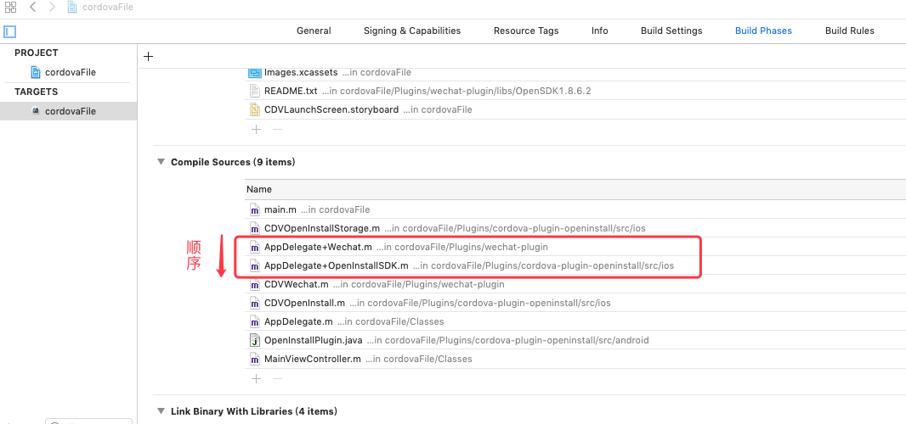
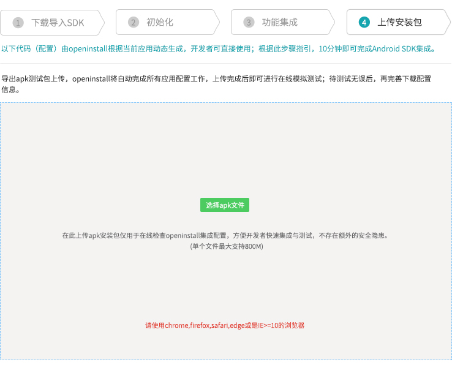

# cordova-plugin-openinstall
openinstall 的 cordova 插件

### 一、安装插件
注册并创建应用，获取 openinstall 为应用分配的 appkey 和 scheme  
(scheme的值详细获取位置：openinstall应用控制台->Android集成->Android应用配置，iOS同理)  

使用下列命令安装并配置 openinstall 插件
```
cordova plugin add cordova-plugin-openinstall --variable OPENINSTALL_APPKEY=[appkey] --variable OPENINSTALL_SCHEME=[scheme]
```
### 二、初始化
**插件自 2.0.0 版本开始，需要用户调用初始化接口完成SDK的初始化**  
App 启动时，请确保用户同意《隐私政策》之后，再初始化openinstall SDK；如果用户不同意，则不进行openinstall SDK初始化
``` js
window.openinstall.init();
```

### 三、功能集成

#### 1 快速下载
如果只需要快速下载功能，无需其它功能（携带参数安装、渠道统计、一键拉起），完成初始化即可

#### 2 一键拉起
##### 拉起参数获取
调用以下代码注册拉起回调，应尽早调用。如在 `deviceready` 事件回调之时注册
``` js
window.openinstall.registerWakeUpHandler(function(data){
  console.log("openinstall.wakeup success : channel=" + data.channel + ", data=" + data.data);
}, function(msg){
  console.log("openinstall.wakeup error : " + msg)
});
```
__注意__：对于 iOS，iOS9.0以后建议使用通用链接（Universal links）实现一键唤醒，为确保能正常跳转，AppID 必须开启 Associated Domains 功能，请到[苹果开发者网站](https://developer.apple.com)，选择 Certificate, Identifiers & Profiles，选择相应的 AppID，开启 Associated Domains。注意：当 AppID 重新编辑过之后，需要更新相应的 mobileprovision 证书。(图文步骤请参考[Cordova接入指南](https://www.openinstall.io/doc/cordova_sdk.html))  
- 在左侧导航器中点击您的项目  
- 选择'Capabilities'标签  
- 打开'Associated Domains'开关  
- 添加openinstall官网后台中应用对应的关联域名（openinstall应用控制台->iOS集成->iOS应用配置->关联域名(Associated Domains)）

**openinstall完全兼容微信openSDK1.8.6以上版本的通用链接跳转功能，注意微信SDK初始化方法中，传入正确格式的universal link链接：**  

``` objc
//your_wxAppID从微信后台获取，yourAppkey从openinstall后台获取
[WXApi registerApp:@"your_wxAppID" universalLink:@"https://yourAppkey.openinstall.io/ulink/"];
```

- **使用 微信相关cordova插件 时，如果要传`universallink`参数的话，请和上面代码中的保持一致**

- 微信开放平台后台Universal links配置，要和上面代码中的保持一致  

  

- 如果使用了类似 `cordova-plugin-wechat` 插件，为了互相兼容，请注意Xcode工程->TARGETS->Build Phases->Compile Sources，  
检查`AppDelegate+Wechat.m`和`AppDelegate+OpenInstallSDK.m`是否按从上往下顺序排放：



- 微信SDK更新参考[微信开放平台更新文档](https://developers.weixin.qq.com/doc/oplatform/Mobile_App/Access_Guide/iOS.html)  


#### 3 携带参数安装 （高级版功能）
##### 获取安装参数  
``` js
window.openinstall.getInstall(function(data){
    console.log('openinstall.getInstall success: ' + data);
}, function(msg){
    console.log('openinstall.getInstall error: ' + msg);
});
```
也可传入一个整形数值，单位秒，指定时间未返回将超时  
``` js
window.openinstall.getInstall(function(data){
    console.log('openinstall.getInstall success: ' + data);
}, function(msg){
    console.log('openinstall.getInstall error: ' + msg);
}, 10);
```
成功回调的data数据格式  
``` json
{"channel": "渠道号", "data": {"自定义key": "自定义value"}}
```

#### 4 渠道统计 （高级版功能）  
SDK 会自动完成访问量、点击量、安装量、活跃量、留存率等统计工作。

##### 4.1 注册量统计  
如需统计每个渠道的注册量（对评估渠道质量很重要），可根据自身的业务规则，在确保用户完成 app 注册的情况下调用相关api  
``` js
window.openinstall.reportRegister();
```

##### 4.2 渠道效果统计  
效果点建立在渠道基础之上，主要用来统计终端用户对某些特殊业务的使用效果，如充值金额，分享次数等等。  

调用接口前，请先进入管理后台“效果点管理”中添加效果点  

``` js
window.openinstall.reportEffectPoint("effect_test", 1);
```
第一个参数为“效果点ID”，字符串类型  
第二个参数为“效果点值”，数字类型  
  
调用接口后，可在后台查看效果点统计数据

### 四、导出apk/api包并上传
- 代码集成完毕后，需要导出安装包上传openinstall后台，openinstall会自动完成所有的应用配置工作。  
- 上传完成后即可开始在线模拟测试，体验完整的App安装/拉起流程；待测试无误后，再完善下载配置信息。

  

